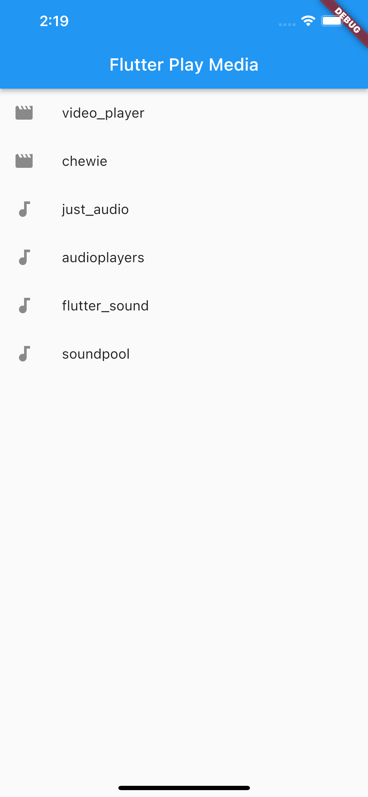
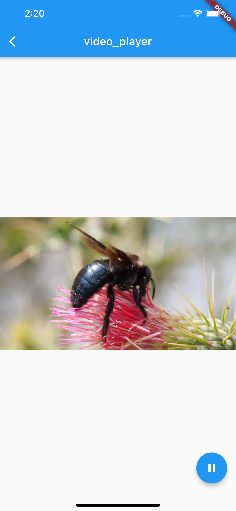
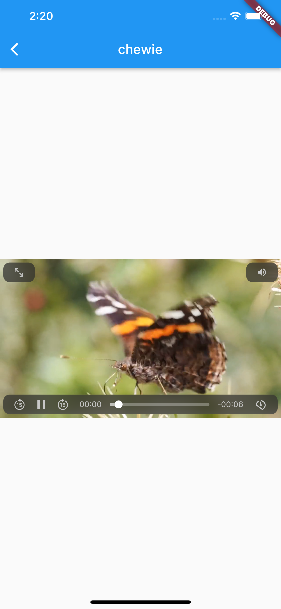
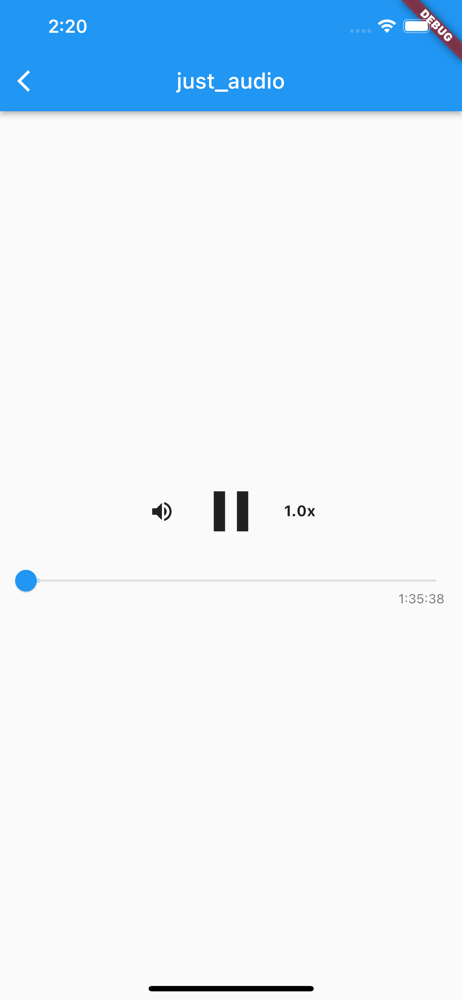
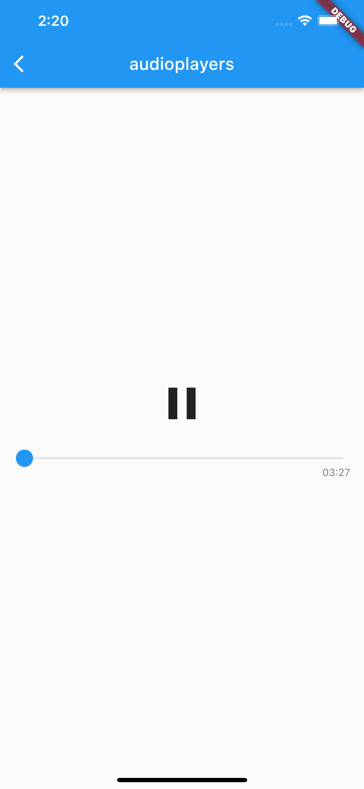
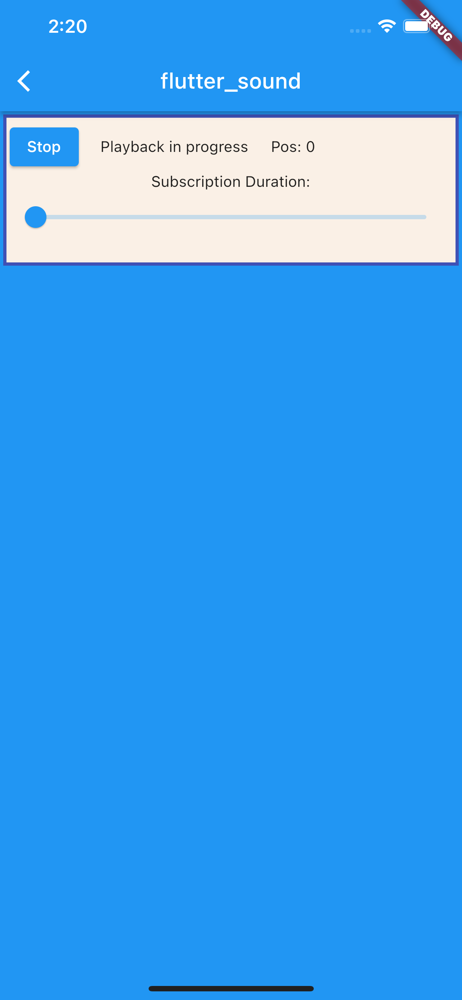
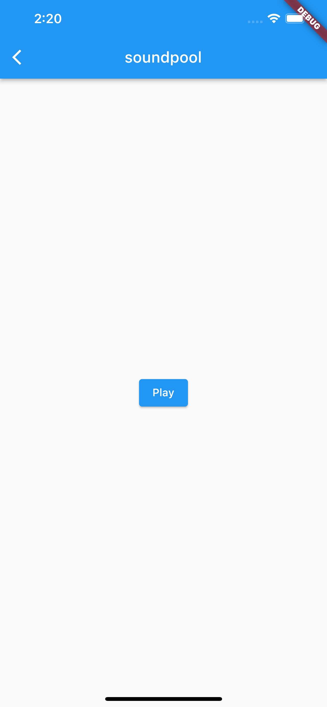

# FlutterPlayMedia
This repository is a sample of how to play media with Flutter.  

# Packages I tried
- Video
  |[video_player](https://pub.dev/packages/video_player)|[chewie](https://pub.dev/packages/chewie)|
  |:---:|:---:|
  |||
    
- Audio
  |[just_audio](https://pub.dev/packages/just_audio)|[audioplayers](https://pub.dev/packages/audioplayers)|
  |:---:|:---:|
  |||

  |[flutter_sound](https://pub.dev/packages/flutter_sound)|[soundpool](https://pub.dev/packages/soundpool)|
  |:---:|:---:|
  |||
    